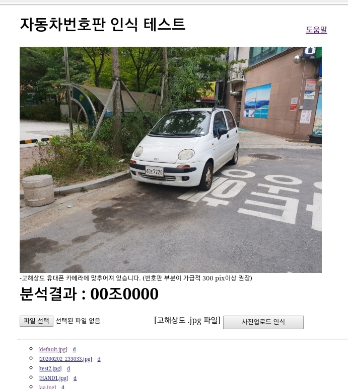

psp : python jsp, python server page 

	jsp functionality in python that works in a similar way to jsp
	WEB/WAS Service 

	Sample PSP Code
		Html code 
		<% python code %>
		<%= python variable %>
		<%%> : block end 
		Html code 

	service function
		http_handler.getSession(): session 
		http_handler : SimpleHTTPRequestHandler class

	service files
		psp(jsp), py, html,  js, image, ...

	If only path is given 
      - directory service file find process
		index.psp > index.py > index.html

program source 
	
	was.py : 
		WEB Server 
	pspconfig.py : 
		port, directory ... setup file
	gen.py : 
		generator ps file to py 

	WEB/index.psp : 
		sample psp  code
	WEB/index.PY : 
		sample psp generate code

home page 
	
	psp demo : 
		Connect with "Deep Learning module" later.
		

install and test 

	install : 
		git clone https://github.com/jangsooyoung/psp.git
	setup   : 
		cd psp
		editing pspconfig.py 
	running : 
		python3 was.py 
